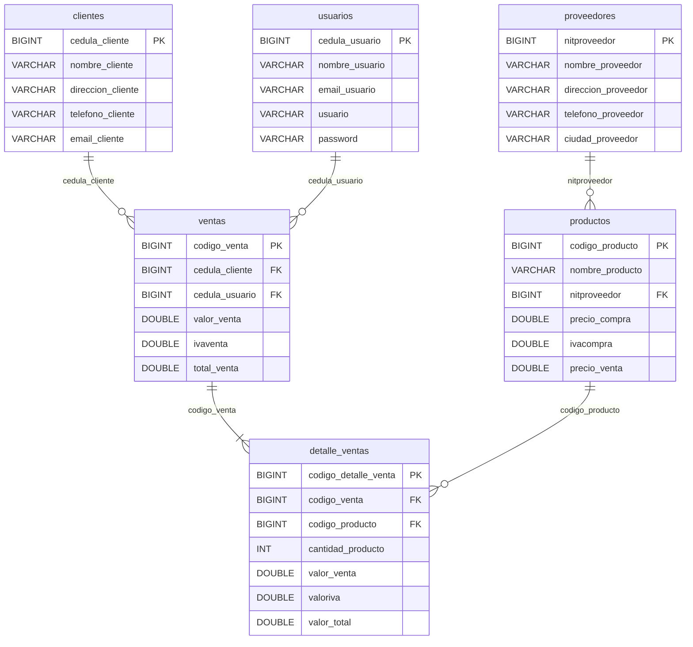
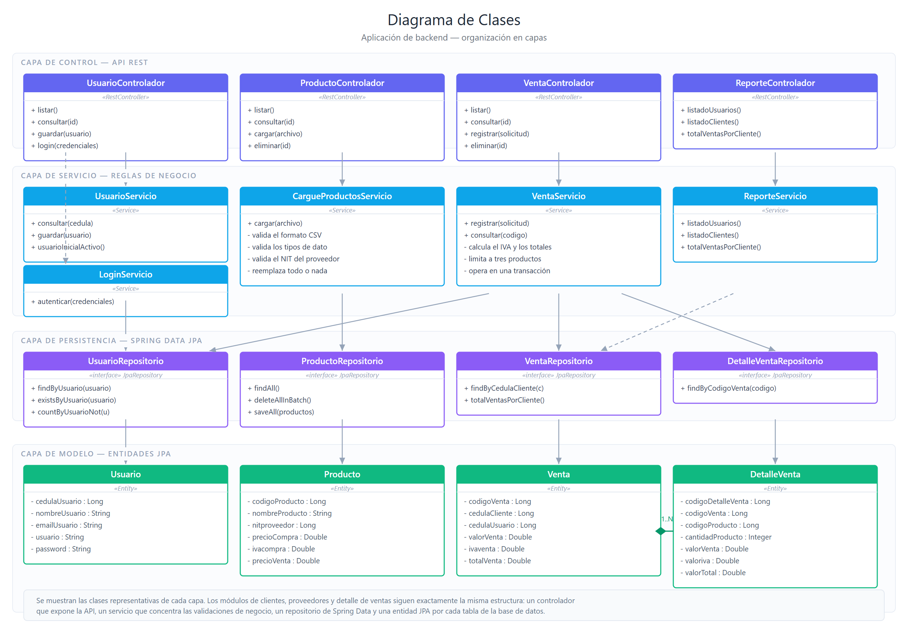

# 5. Especificación de Diseño de la Base de Datos

Base de datos: **`tiendagenerica`** (MySQL 8.4).

## Modelo entidad-relación



## Estructura de las tablas

### `usuarios`
| Columna | Tipo | Descripción |
|---|---|---|
| `cedula_usuario` | BIGINT(20) PK | Cédula del usuario |
| `nombre_usuario` | VARCHAR(255) | Nombre completo |
| `email_usuario` | VARCHAR(255) | Correo electrónico |
| `usuario` | VARCHAR(255) | Nombre de ingreso al sistema |
| `password` | VARCHAR(255) | Contraseña cifrada con BCrypt |

### `clientes`
| Columna | Tipo | Descripción |
|---|---|---|
| `cedula_cliente` | BIGINT(20) PK | Cédula del cliente |
| `nombre_cliente` | VARCHAR(255) | Nombre completo |
| `direccion_cliente` | VARCHAR(255) | Dirección |
| `telefono_cliente` | VARCHAR(255) | Teléfono |
| `email_cliente` | VARCHAR(255) | Correo electrónico |

### `proveedores`
| Columna | Tipo | Descripción |
|---|---|---|
| `nitproveedor` | BIGINT(20) PK | NIT del proveedor |
| `nombre_proveedor` | VARCHAR(255) | Razón social |
| `direccion_proveedor` | VARCHAR(255) | Dirección |
| `telefono_proveedor` | VARCHAR(255) | Teléfono |
| `ciudad_proveedor` | VARCHAR(255) | Ciudad |

### `productos`
| Columna | Tipo | Descripción |
|---|---|---|
| `codigo_producto` | BIGINT(20) PK | Código del producto |
| `nombre_producto` | VARCHAR(255) | Nombre del producto |
| `nitproveedor` | BIGINT(20) FK | NIT del proveedor que lo suministra |
| `precio_compra` | DOUBLE | Precio de compra |
| `ivacompra` | DOUBLE | Porcentaje de IVA (ej. 19) |
| `precio_venta` | DOUBLE | Precio de venta al público |

### `ventas`
| Columna | Tipo | Descripción |
|---|---|---|
| `codigo_venta` | BIGINT(20) PK AUTO_INCREMENT | Consecutivo de la venta |
| `cedula_cliente` | BIGINT(20) FK | Cliente de la venta |
| `cedula_usuario` | BIGINT(20) FK | Usuario que registra la venta |
| `valor_venta` | DOUBLE | Total de la venta sin IVA |
| `ivaventa` | DOUBLE | Total del IVA de la venta |
| `total_venta` | DOUBLE | Total de la venta con IVA |

### `detalle_ventas`
| Columna | Tipo | Descripción |
|---|---|---|
| `codigo_detalle_venta` | BIGINT(20) PK AUTO_INCREMENT | Consecutivo del detalle |
| `codigo_venta` | BIGINT(20) FK | Venta a la que pertenece |
| `codigo_producto` | BIGINT(20) FK | Producto vendido |
| `cantidad_producto` | INT(11) | Unidades vendidas |
| `valor_venta` | DOUBLE | Valor unitario (precio de venta) |
| `valoriva` | DOUBLE | IVA calculado para la línea |
| `valor_total` | DOUBLE | cantidad × valor unitario |

## Diagrama de clases

Organización del backend en capas, con las clases representativas de cada una:



| Capa | Responsabilidad |
|---|---|
| Control | Expone la API REST. No contiene lógica de negocio: delega en la capa de servicio. |
| Servicio | Concentra las validaciones y las reglas de negocio, y define los límites transaccionales. |
| Persistencia | Interfaces de Spring Data JPA. El framework genera la implementación a partir del nombre del método. |
| Modelo | Entidades JPA, una por cada tabla de la base de datos. |

Los módulos de clientes, proveedores y detalle de ventas siguen exactamente la misma
estructura, por lo que se omiten del diagrama para mantenerlo legible.

## Generación del esquema

El esquema lo genera Hibernate mediante `spring.jpa.hibernate.ddl-auto=update`,
tal como establece la especificación técnica del documento.

## DDL equivalente

Para quien prefiera crear el esquema manualmente, con integridad referencial explícita:

```sql
CREATE DATABASE IF NOT EXISTS tiendagenerica
  DEFAULT CHARACTER SET utf8mb4 COLLATE utf8mb4_unicode_ci;
USE tiendagenerica;

CREATE TABLE usuarios (
  cedula_usuario BIGINT(20) NOT NULL,
  nombre_usuario VARCHAR(255),
  email_usuario  VARCHAR(255),
  usuario        VARCHAR(255),
  password       VARCHAR(255),
  PRIMARY KEY (cedula_usuario)
);

CREATE TABLE clientes (
  cedula_cliente    BIGINT(20) NOT NULL,
  nombre_cliente    VARCHAR(255),
  direccion_cliente VARCHAR(255),
  telefono_cliente  VARCHAR(255),
  email_cliente     VARCHAR(255),
  PRIMARY KEY (cedula_cliente)
);

CREATE TABLE proveedores (
  nitproveedor        BIGINT(20) NOT NULL,
  nombre_proveedor    VARCHAR(255),
  direccion_proveedor VARCHAR(255),
  telefono_proveedor  VARCHAR(255),
  ciudad_proveedor    VARCHAR(255),
  PRIMARY KEY (nitproveedor)
);

CREATE TABLE productos (
  codigo_producto BIGINT(20) NOT NULL,
  nombre_producto VARCHAR(255),
  nitproveedor    BIGINT(20),
  precio_compra   DOUBLE,
  ivacompra       DOUBLE,
  precio_venta    DOUBLE,
  PRIMARY KEY (codigo_producto),
  CONSTRAINT fk_productos_proveedor
    FOREIGN KEY (nitproveedor) REFERENCES proveedores (nitproveedor)
);

CREATE TABLE ventas (
  codigo_venta   BIGINT(20) NOT NULL AUTO_INCREMENT,
  cedula_cliente BIGINT(20),
  cedula_usuario BIGINT(20),
  valor_venta    DOUBLE,
  ivaventa       DOUBLE,
  total_venta    DOUBLE,
  PRIMARY KEY (codigo_venta),
  CONSTRAINT fk_ventas_cliente
    FOREIGN KEY (cedula_cliente) REFERENCES clientes (cedula_cliente),
  CONSTRAINT fk_ventas_usuario
    FOREIGN KEY (cedula_usuario) REFERENCES usuarios (cedula_usuario)
);

CREATE TABLE detalle_ventas (
  codigo_detalle_venta BIGINT(20) NOT NULL AUTO_INCREMENT,
  codigo_venta         BIGINT(20),
  codigo_producto      BIGINT(20),
  cantidad_producto    INT(11),
  valor_venta          DOUBLE,
  valoriva             DOUBLE,
  valor_total          DOUBLE,
  PRIMARY KEY (codigo_detalle_venta),
  CONSTRAINT fk_detalle_venta
    FOREIGN KEY (codigo_venta) REFERENCES ventas (codigo_venta),
  CONSTRAINT fk_detalle_producto
    FOREIGN KEY (codigo_producto) REFERENCES productos (codigo_producto)
);
```

> **Nota de diseño.** En el código las claves foráneas se modelan como columnas
> `BIGINT` simples y la integridad referencial se valida en la capa de servicio.
> Esto mantiene los cuerpos JSON planos, exactamente como los define la
> especificación de la API. El DDL anterior añade las restricciones a nivel de motor
> para quien desee crear el esquema por fuera de Hibernate.
